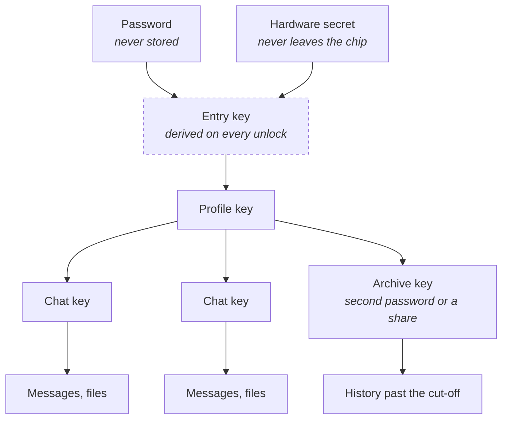

# LetheWis

A Rust library for the lifecycle of encryption keys on a device that may be taken from its owner:

- key derivation from a password, from a recovery phrase, and from a hardware secret;
- a key hierarchy with per-key state and versioning;
- destruction of a single key or of a whole profile;
- recovery independent of the hardware, and detection of a lost key;
- conditional access: key shares held by other people, and a time lock.

It is for applications where seizure is part of the threat model: wallets, password managers, notes,
tools for crossing a border, evidence collection. Properties that can be stated precisely are proven
formally wherever that is possible; what cannot be proven is measured on real devices and described
as measured. The core is platform-independent and builds without the standard library and without a
memory allocator; hardware binding is a crate of its own for each platform, Android first.
Suggestions for functionality not listed here are accepted as issues.

## How the keys relate

A key is never alone: each one opens only the level below it. Destroying one link makes everything
under it unreadable and leaves the rest untouched: deleting a chat destroys that chat's key, and
nothing else. The entry key is dashed because it is not stored anywhere: it is derived from the
password and the hardware secret at each unlock, and neither alone is enough.

## What is not guaranteed

- **Destroying a key is "most likely gone", never "certainly gone."** The key sits on flash memory as
  a file, and flash is not overwritten in place. A copy of the device made before the destruction is
  unaffected by it.
- **Wiping a value from memory does not reach every copy.** A copy left by a value move, a buffer
  reallocation, a CPU register, swap, or a crash dump is outside what this library can clear.
- **Hardware-backed keys are not available everywhere.** A dedicated secure element is absent on a
  large share of Android devices, and our figure for that share is an estimate rather than a
  measurement. Where the element is missing, protection falls back and records the level actually
  reached.
- **A device unlocked since boot has its keys in memory already.** No key-storage library changes
  that, and a lock screen is not a defence against someone holding such a device.
- **A proof is about one named statement, not about safety.** Where a property is proven, the claim
  names the tool, its version, the assumptions and what is not covered. The phrase "formally
  verified" is not used here on its own.

The full statement of what is and is not defended, with the assumptions behind each:
[docs/threat-model.md](docs/threat-model.md).

## Crates

Split along the boundary of what is proven: anything that reaches the system or the network is a
separate crate, so the proof perimeter is visible from the directory listing.

| Crate | Contents |
|---|---|
| `lethewis-core` | derivation, hierarchy, lifecycle, destruction, two-tier access. Pure logic: no system, no network, no clock |

Hardware binding, key shares and the time lock will each be a crate of its own, listed here when it
exists.

Claimed and proven properties: [docs/proofs.md](docs/proofs.md).

Minimum supported Rust version: **1.99**, as declared in the manifest. Newer compilers work, and a
raise of this minimum is recorded in [CHANGELOG.md](CHANGELOG.md). Building this repository uses
exactly 1.99.0, pinned in `rust-toolchain.toml`: a build that reproduces byte for byte needs one exact
compiler rather than a channel. That pin is not part of the published package and does not constrain
what a dependent builds with.

How dependencies are reviewed, and which versions a dependent receives:
[SECURITY.md](SECURITY.md#dependencies).

## Reporting and contributing

- **Security:** report through the private advisory form, not as a public issue. Terms and
  timings: [SECURITY.md](SECURITY.md).
- **Bugs and problems with a proof:** open an issue. A property that does not hold is the single most
  useful report this project can get.
- **Suggestions and requests for functionality** not listed above: open an issue. A use the library
  does not cover yet is worth knowing about.
- **Code:** not accepted yet; [CONTRIBUTING.md](CONTRIBUTING.md) explains why. Describe the fix in
  an issue instead.
- **Conduct:** [CODE_OF_CONDUCT.md](CODE_OF_CONDUCT.md).

## Licence

[GNU AGPL v3 only](LICENSE).

**A commercial licence without the AGPL's obligations is available.** Write to
<hi@alanwisper.com>.
